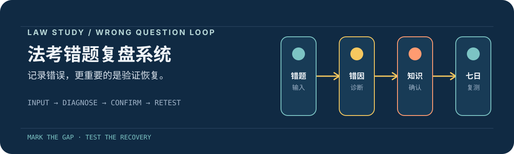

# 法考错题复盘系统

### 把“做错一道题”变成一条可追踪、可复测、可恢复的学习闭环

错题分析 · 知识图谱标注 · 日/周复盘 · 七日复测 · 学习文档

<p align="center">
  <a href="https://github.com/zzzrh1/zrh-fakao"></a>
  <a href="https://github.com/zzzrh1/zrh-fakao"></a>
  <a href="https://github.com/zzzrh1/zrh-fakao"></a>
</p>

<p align="center">
  
</p>

## 这是什么

这是一个面向法考学习的错题复盘 skill。它不只保存“错了哪道题”，而是把每道错题拆成以下学习闭环；同时支持用户上传自己的 XMind 思维导图进行标注。思维导图输入必须是 `.xmind` 格式，当前仓库只内置民诉示例，其他科目后续更新：

```text
错题输入 → 结构化识别 → 错因诊断 → 知识点确认 → 图谱标注 → 七日复测 → 恢复追踪
```

核心原则：**先分析、再确认、后写入**。未经确认的知识点和错因不会直接进入持久化复盘库。

## 能解决什么

| 模块 | 作用 | 产物 |
| --- | --- | --- |
| 错题诊断 | 从题干、选项、解析中提取知识点，区分知识不会与思路错误 | 结构化错题卡 |
| 知识图谱 | 将直接薄弱点标红，将易混/相邻点标黄 | 标注版图谱 |
| 日复盘 | 汇总当天科目、单元、错因和优先修复点 | 每日 Markdown |
| 七日复测 | 到期后记录 `passed`、`failed` 或 `skipped` | 复测队列与日志 |
| 学习文档 | 围绕薄弱点生成前置知识、讲解、易混点和反馈区 | 学习文档 |
| 数据面板 | 从统计真源计算错题数、错因组成和复测通过率 | 指标面板 |

## 快速开始

### 1. 准备错题输入

可以直接发送完整题目、截图，或粘贴 OCR 文本：

```text
我错了一道题：

【题目】……
【选项】A. …… B. …… C. …… D. ……
【我的答案】A
【正确答案】B
【解析】……
```

也可以只描述混淆点：

```text
我总是分不清管辖权异议和管辖协议。
```

### 2. 确认后写入

Agent 会先展示识别出的解析和候选知识点，然后只要求确认两项：

1. 实际写入的知识点；
2. 一个错因标签：`1 知识点不会` 或 `2 知识点会但是做题思路不对`。

确认后才写入复盘库，并生成七日复测任务。

### 3. 使用脚本

脚本路径均使用运行时参数，不依赖固定用户名或固定电脑目录。完整路径约定见 [`references/path-configuration.md`](references/path-configuration.md)。

```bash
REVIEW_VAULT="<REVIEW_VAULT>"
TECHNICAL_WORKSPACE="<TECHNICAL_WORKSPACE>"

node scripts/init-review-vault.js "$REVIEW_VAULT"
node scripts/prepare-confirmation.js "$TECHNICAL_WORKSPACE/recognized-mistakes.json" "$TECHNICAL_WORKSPACE/confirmation.md"
node scripts/ingest-mistakes.js "$REVIEW_VAULT" "$TECHNICAL_WORKSPACE/confirmed-mistakes.json"
node scripts/metrics-dashboard.js "$REVIEW_VAULT" "$TECHNICAL_WORKSPACE/metrics-dashboard.md"
```

## 工作流

### 错题入库

```text
接收图片/文本
    ↓
提取题干、选项、答案、解析
    ↓
诊断表层知识点、根因和易混点
    ↓
用户确认知识点 + 错因
    ↓
写入每日错题卡、统计索引、科目页和复测队列
```

### 图谱标注

- 🔴 **红色**：直接薄弱点或重复/高影响错误。
- 基础图谱保持无颜色；标注结果写入独立输出，不污染原始图谱。

如果用户提供了自己的思维导图，必须使用 `.xmind` 格式。当前仓库只提供民诉示例，其他科目会在后续版本更新。确认后运行：

```bash
SOURCE_XMIND="<SOURCE_XMIND>"
MARKS_JSON="<MARKS_JSON>"

node scripts/mark-xmind.js "$SOURCE_XMIND" "$MARKS_JSON"
```

脚本会保留源文件，并在同目录生成 `-标注版.xmind`。OPML、PDF 和图片不能作为这一步的思维导图输入。

## 文件结构

```text
00-index/
├── mistake-index.json
└── retest-queue.json
01-daily/YYYY-MM-DD/
├── YYYY-MM-DD.md
├── 1-原始错题素材/
└── 2-整理好的错题/
02-weekly/
03-maps/<科目>/
04-mistakes/by-subject/<科目>/
04-mistakes/by-cause/<错因>/
05-learning-docs/
```

仓库中的示例资料目前只覆盖民诉；其中 `.xmind` 文件可用于思维导图标注演示，Markdown/OPML 仅作导出参考，不会覆盖用户自己的资料。

## 可移植性

这个 skill 面向其他用户复用：

- 不写死用户主目录、桌面目录、Obsidian vault 或备份目录。
- 运行时配置 `REVIEW_VAULT`、`TECHNICAL_WORKSPACE`、`SOURCE_MATERIALS`、`SOURCE_XMIND`、`GRAPH_FILE`、`BACKUP_DIR` 和 `TARGET_VAULT`。
- 没有指定持久化路径时，默认停留在预览模式或使用宿主提供的临时目录。
- 用户提供的图谱优先；内置公司法图谱仅作为相关科目的 fallback。
- 没有可信题库时，不宣称题库精确匹配。

## 当前边界

- OCR 由 Agent 的视觉能力或外部 OCR 完成，仓库不绑定某个 OCR 服务。
- 自动法律解释需要结合题目证据生成，不把低置信度推断当成事实。
- 复测题可以按要求生成，但不把实验题当作权威题库。
- 日复盘和七日复测是本地文件闭环，不默认连接云端提醒服务。

## 作者

**AI法师张诚**

- 抖音：AI法师张诚，欢迎大家关注；以后会持续更新 AI 法律应用。
- 🛰️：`ZRHuai-`

## License

本仓库当前未附加独立许可证文件。转载、改编或用于其他项目时，请保留作者信息并遵守相关资料的原始授权要求。

<p align="center"><sub>面向真实学习过程设计：记录错误，更重要的是验证恢复。</sub></p>
